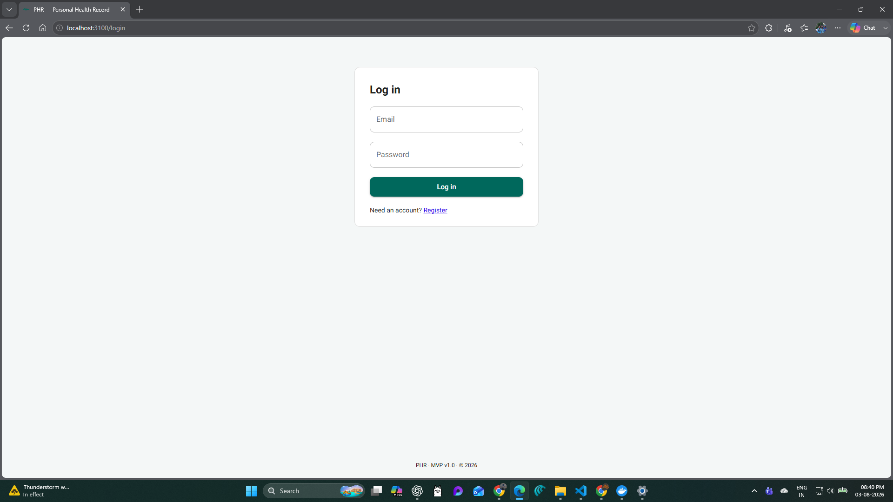
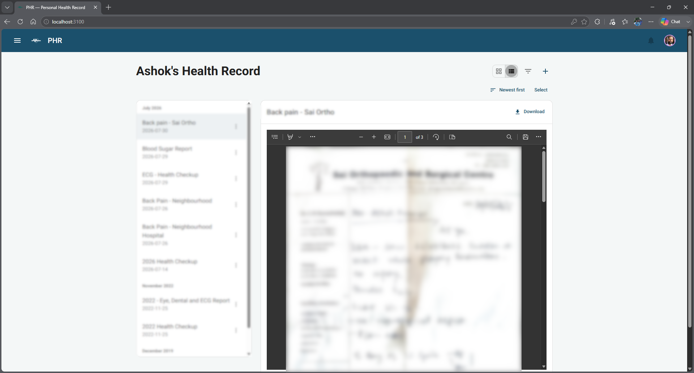
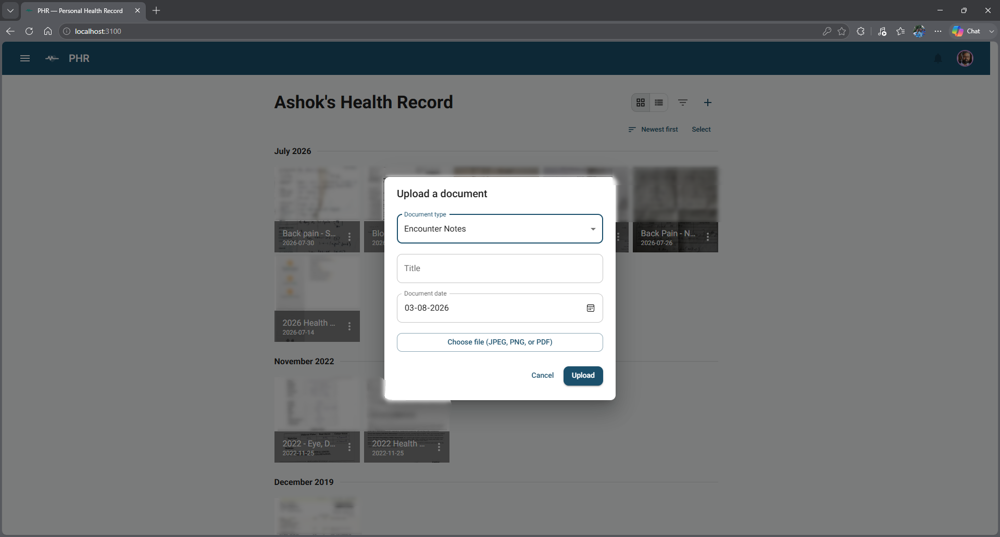
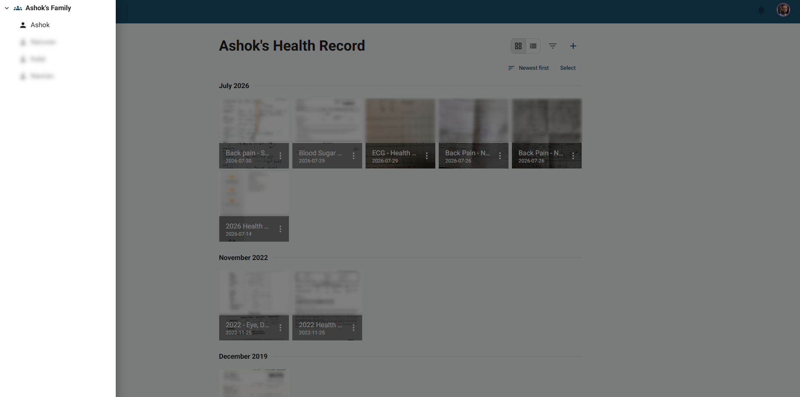
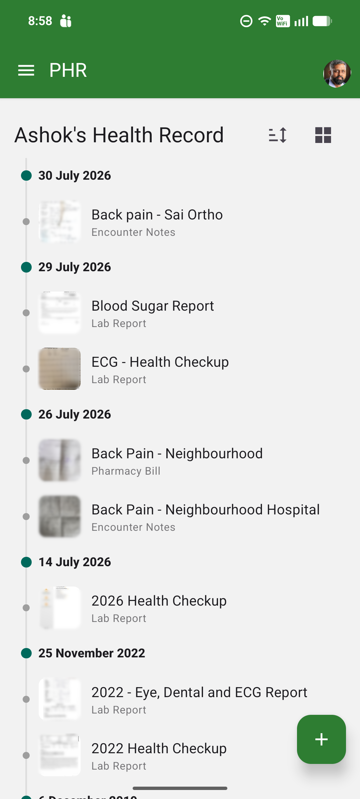

# Personal Health Record (PHR)

[](https://github.com/ashokkumarin/personal-health-record/actions/workflows/ci.yml)
[](https://github.com/ashokkumarin/personal-health-record/actions/workflows/release.yml)
[](LICENSE)

A self-hosted, open-source personal health record platform for individuals and families to store, organize, and review medical documents in one place.

The goal of this project is to make health records easier to manage by keeping prescriptions, lab reports, bills, and notes in a single place that can be viewed in a timeline. It is designed for both a web dashboard and a mobile app, with privacy-focused family sharing controls.

## Screenshots

> The images below are placeholders — see
> [docs/screenshots/README.md](docs/screenshots/README.md) for what needs to
> be captured and how.

| | |
|---|---|
|  |  |
|  |  |



## Project goal

This project aims to provide a simple and trustworthy way to keep personal and family medical records together without relying on a proprietary cloud service. Users can capture or upload documents, attach them to a patient profile, and browse them chronologically over time.

## MVP features

- User registration and login
- Family creation and family member management
- Patient profiles for family members
- Upload of medical documents as images or PDFs
- Best-effort OCR and thumbnail generation
- Timeline-based browsing with search and filtering
- Preview, edit, replace, and delete of uploaded records
- Privacy controls so records remain private by default
- Web app and mobile app clients
- Admin panel: user management, audit log viewer, and admin-driven password resets
- Configurable mobile background sync interval (1–180 minutes)

## Architecture

This repository uses a TypeScript monorepo with shared contracts across the stack:

- API: Node.js, TypeScript, Fastify, Prisma, PostgreSQL
- Web app: Next.js, React, Material UI
- Mobile app: Expo, React Native
- Storage: uploaded documents/thumbnails/avatars are stored on local disk under a configurable `MEDIA_ROOT` folder (see `.env.example`), served through a signed-URL route on the API — no object storage service required

### Repository layout

- apps/api — backend API and business logic
- apps/web — web dashboard
- apps/mobile — mobile client
- packages/shared — shared schemas, types, and API helpers
- docs — product requirements, specs, and implementation design

## Getting started

### Prerequisites

- Node.js 22+
- Docker Desktop (for PostgreSQL)
- npm
- [poppler-utils](https://poppler.freedesktop.org/) (`pdftoppm`) — used to render PDF page-1 thumbnails. Without it, PDF uploads still work but come back with no thumbnail (best-effort, same as an unsupported file type). Install via `apt install poppler-utils` (Debian/Ubuntu), `brew install poppler` (Mac), or `choco install poppler`/`winget install --id=oschwartz10612.Poppler` (Windows) and ensure `pdftoppm` is on `PATH`.

### 1. Install dependencies

```bash
npm install
```

### 2. Configure environment

```bash
cp .env.example .env
```

### 3. Start local services

```bash
docker compose up -d postgres
```

This starts PostgreSQL for local development. Uploaded files are stored directly on disk under the folder configured by `MEDIA_ROOT` in `.env` (default `./data/media`, created automatically) — no additional service required.

> `docker-compose.yml` also defines `api` and `web` services (see [Running the full stack in Docker](#running-the-full-stack-in-docker) below). Starting just `postgres` here avoids port clashes with `npm run dev:api`/`dev:web` on the host.

### 4. Run database migrations

```bash
cd apps/api
npx prisma migrate deploy
npx prisma generate
```

### 5. Build the shared package

```bash
npm run build:shared
```

### 6. Start the apps

In separate terminals:

```bash
npm run dev:api
npm run dev:web
```

Optional mobile app:

```bash
npm run dev:mobile
```

The API defaults to http://localhost:4000 and the web app to http://localhost:3000.

## Running from published images (recommended for homelab use)

No source checkout or build tooling required — this pulls pre-built images published by CI on every release.

```bash
mkdir phr && cd phr
curl -fsSLO https://raw.githubusercontent.com/ashokkumarin/personal-health-record/main/docker/release/docker-compose.yml
curl -fsSLO https://raw.githubusercontent.com/ashokkumarin/personal-health-record/main/docker/release/.env.example
cp .env.example .env   # edit JWT_SECRET, ports, and *_PUBLIC_URL/ORIGIN
docker compose up -d
```

Images are published to GHCR (`ghcr.io/ashokkumarin/phr-api`, `phr-web`) and
Docker Hub, for both `linux/amd64` and `linux/arm64` (Raspberry Pi/NAS
friendly). Pin `PHR_VERSION` in `.env` to a specific
[release](https://github.com/ashokkumarin/personal-health-record/releases)
tag rather than tracking `latest` once you have real data in the instance —
bump it deliberately with `docker compose up -d --pull always` when you're
ready to upgrade.

**Back up your data.** This project doesn't back anything up for you — see
[docs/backup-and-restore.md](docs/backup-and-restore.md) for what to back up
and how, including a full disaster-recovery walkthrough.

## Building the full stack from source (for development/contributing)

For a homelab or any host without Node.js installed, `docker-compose.yml` also builds and runs the `api` and `web` apps as containers alongside `postgres`.

```bash
cp .env.example .env   # if you haven't already
docker compose up -d --build
```

This builds the API and web images, runs Prisma migrations automatically on API startup, and serves:

- Web app on `http://<host>:${WEB_PORT}` (default 3000)
- API on `http://<host>:${API_PORT}` (default 4000)

Uploaded files persist in the `phr-media` docker volume (mounted at `/app/media` in the `api` container). To keep them directly on disk instead, replace `phr-media:/app/media` in `docker-compose.yml` with a bind mount, e.g. `./data/media:/app/media`.

### Changing the port

Ports are not hardcoded into the images — they're read from environment variables at container start, so no rebuild is needed. Edit `.env`:

```bash
WEB_PORT=8080
API_PORT=8081
```

Also update `API_PUBLIC_URL` and `WEB_ORIGIN` in `.env` to match the address your browser/homelab network actually uses to reach this host (e.g. `API_PUBLIC_URL=http://192.168.1.50:8081`), then:

```bash
docker compose up -d
```

The web app talks to the API through a same-origin `/api` proxy (a Next.js route handler at `apps/web/app/api/[...path]/route.ts`, forwarding to `API_INTERNAL_URL`), so the browser never needs to know the API's host/port directly — only `API_PUBLIC_URL` (used for direct file-download links) needs to match how your browser reaches the server.

## Testing

```bash
npm run test:api
```

## Documentation

**[docs/README.md](docs/README.md)** is the full technical wiki — C1–C4
architecture diagrams, the complete API reference, the data model, and a guide
per app/service.

The original product requirements and delivery history are documented in:

- [docs/requirements-and-project-plan.md](docs/requirements-and-project-plan.md)
- [docs/specs/mvp-spec.md](docs/specs/mvp-spec.md)
- [docs/specs/technical-design.md](docs/specs/technical-design.md)

## Contributing

Contributions are welcome — see [CONTRIBUTING.md](CONTRIBUTING.md) for the
development workflow and [CODE_OF_CONDUCT.md](CODE_OF_CONDUCT.md) for
community guidelines. Please report security vulnerabilities privately per
[SECURITY.md](SECURITY.md) rather than filing a public issue.

## License

Licensed under [AGPL-3.0-or-later](LICENSE). If you run a modified version
of this project as a network service, the AGPL requires that you make your
modified source available to that service's users.

## Current status

This repository contains the MVP v1.0 implementation of the project.
