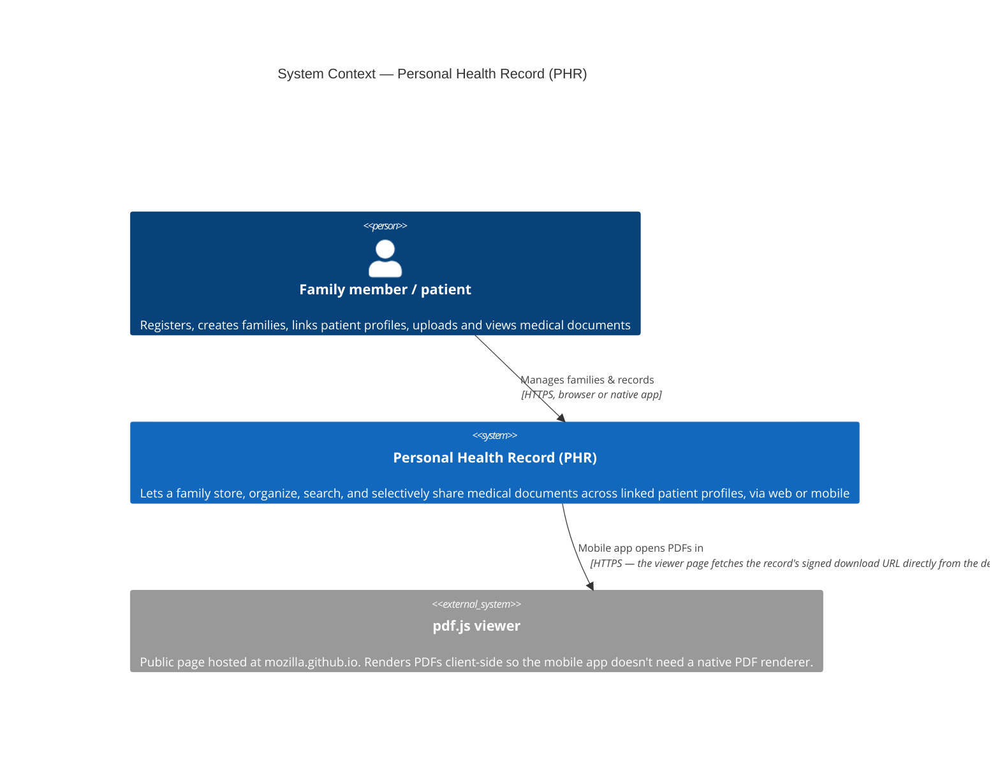

# C1 — System Context

The highest-level view: PHR as a single black box, who uses it, and the one
external system it depends on.

## Why there's (almost) nothing external

PHR has no third-party integrations — no email/SMS provider, no payment
processor, no external identity provider, no cloud storage service. Everything
is self-hosted: auth is homegrown JWT, files live on a local filesystem volume,
and the database is a plain PostgreSQL instance (see
[Deployment](../deployment.md)). The **only** external dependency the system
context needs to show is the mobile app's use of the publicly-hosted `pdf.js`
viewer for in-app PDF preview — see
[Mobile app → PDF viewing](../apps/mobile-app.md#pdf-viewing) for why that
approach was chosen (Android's embedded WebView has no built-in PDF renderer).

## Who "the user" actually is

There's a single actor type — no separate admin/staff role at the system-context
level. Within a *family*, a user can hold one of three roles (`OWNER`, `ADMIN`,
`MEMBER`) that gate management actions, and a *patient profile* can be linked to
a user's account or left account-less (e.g. a child or elderly relative who
won't log in themself) — but all of that nuance lives inside the system, not at
this level. See [C3 — Component](c3-component.md) and the
[data model](../data-model.md) for those details.
