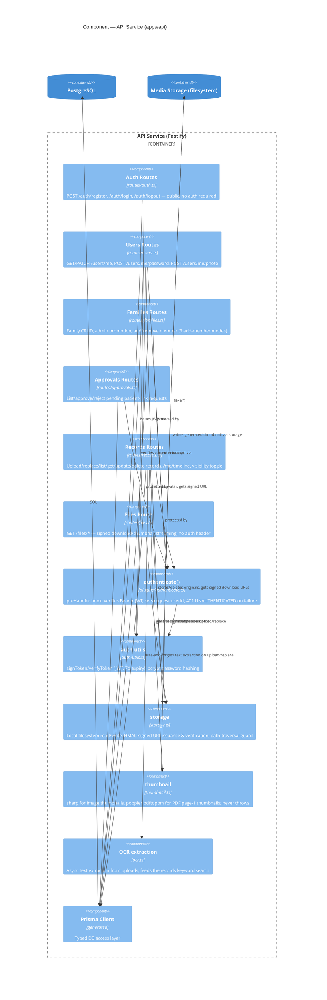

# C3 — Component

Zooming into the **API Service** container — the piece with all the actual
business logic. The web and mobile containers are UI shells over this API, so
this is the most useful component-level view in the system.

## Component notes

### `authenticate()` is plugin-scoped, not global
It's added via `app.addHook("preHandler", authenticate)` inside each protected
route file individually (`users.ts`, `families.ts`, `approvals.ts`,
`records.ts`) rather than once in `app.ts`. `auth.ts` (registration/login) and
`files.ts` (signed downloads) deliberately never register it — those two are
the only genuinely public routes in the system.

### `filesRoutes` doesn't use JWT auth at all
`GET /files/*` is gated by an HMAC signature (`expires` + `sig` query params,
verified with a constant-time comparison) rather than a bearer token. This is
intentional: `downloadUrl`/`thumbnailUrl` values are handed to browsers/WebViews
as plain URLs (in `` tags, `<iframe>`s, native `Image` components) which
can't attach an `Authorization` header. The signature is time-limited to 15
minutes (`URL_TTL_MS` in `storage.ts`) so a leaked URL has a short blast radius.
See [API reference → Files](../api-reference.md#files) and
[Backend service → Signed URLs](../apps/backend-service.md#signed-file-urls).

### Thumbnail generation is synchronous; OCR is not
`recordsRoutes` calls `thumbnail.ts` **synchronously** before responding (the
client needs `thumbnailUrl` in the upload response for the timeline grid to
render immediately). OCR text extraction, by contrast, is fired-and-forgotten
after the response is sent — `ocrText` gets backfilled onto the record a moment
later, which is why keyword search (`GET /families/:familyId/records?q=...`)
can occasionally miss a just-uploaded document for a second or two.

### Authorization logic lives in `records.ts`, not in a shared middleware
Because "can I see/edit this record" depends on three different concepts —
family membership, patient-visibility (`visibleToFamily` + "is this your own
linked patient"), and record ownership — the checks (`isFamilyMember`,
`isRecordVisible`, `canManageRecord`) are plain functions inside `records.ts`
rather than generic Fastify hooks. See
[Data model → Authorization model](../data-model.md#authorization-model) for
the full rule set.
