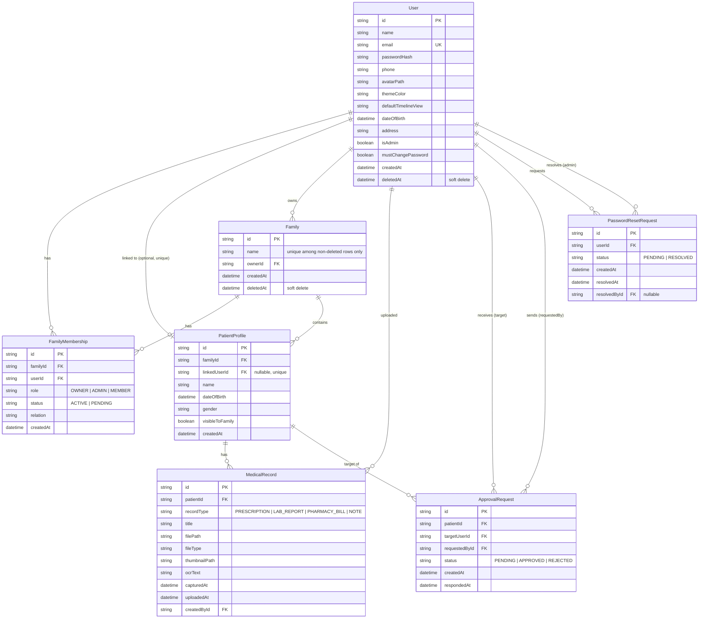

# Data Model

Schema source of truth: `apps/api/prisma/schema.prisma`. PostgreSQL 16 via
Prisma. All primary keys are `uuid()` strings.

## ERD



## Enums

```ts
enum FamilyRole          { OWNER, ADMIN, MEMBER }
enum MembershipStatus    { ACTIVE, PENDING }
enum ApprovalStatus      { PENDING, APPROVED, REJECTED }
enum RecordType          { PRESCRIPTION, LAB_REPORT, PHARMACY_BILL, NOTE }
enum PasswordResetStatus { PENDING, RESOLVED }
```

## Two constraints worth knowing before you touch the schema

### 1. `Family.name` is *conditionally* unique
There's no `@unique` on `Family.name` in the Prisma schema itself — instead a
hand-written migration adds a **partial unique index**, unique only where
`deletedAt IS NULL`. That's what makes `FAMILY_NAME_TAKEN` (see
[API reference → Families](api-reference.md#families)) fire only against
*active* families, and lets a name be reused after the original family is
soft-deleted. If you ever regenerate the schema from `prisma db pull` or write
a new migration by hand, preserve this partial index — a naive
`@@unique([name])` would incorrectly block reusing names after deletion.

### 2. `PatientProfile.linkedUserId` is nullable *and* unique
`String? @unique` — a patient profile can exist with no linked account
(a dependent who'll never log in), but if it *is* linked, that user can only
be linked to **one** patient profile system-wide. This single field is what
the `ALREADY_LINKED` check in `POST /families/:id/members` relies on (a plain
`findUnique` on `linkedUserId`) — see
[API reference → Families](api-reference.md#families).

## System admin (`User.isAdmin`) vs. `FamilyRole`

`User.isAdmin` is a **system-level** flag, unrelated to the per-family
`FamilyRole` (`OWNER`/`ADMIN`/`MEMBER`). An admin can manage every account in
the system (see [API reference → Admin](api-reference.md#admin)); a family
`ADMIN` can only manage members of that one family. There's no tiering among
system admins — any `isAdmin` user has full access.

The first admin is bootstrapped from `ADMIN_EMAIL`/`ADMIN_PASSWORD` on every
API startup (`apps/api/src/bootstrap.ts`, idempotent — see
[Deployment](deployment.md#environment-variables)). Additional admins can only
be created directly in the database today — there's no "promote to system
admin" API route.

### Admin-initiated user deletion is a soft delete, and only ever touches the target's own data
`DELETE /admin/users/:id` sets `User.deletedAt` (blocking future logins) and
cascades to: the user's `FamilyMembership` rows (soft-deleted), their own
linked `PatientProfile` and its `MedicalRecord`s (soft-deleted), and — only if
they're the **sole** member of a family they own — that family itself. If they
own a family that still has other active members, the whole delete is
rejected with `CANNOT_REMOVE_OWNER` (same code family-membership removal uses)
until an admin transfers or deletes that family first. Records the user
uploaded for *other* patients in a shared family are left untouched — deleting
an account doesn't erase family medical history someone else still needs.

## Authorization model

Three checks, all implemented in `apps/api/src/routes/records.ts` (there's no
generic permissions module — each domain's rules live next to its routes):

| Check | Rule |
|---|---|
| `isFamilyMember` | caller has *any* `FamilyMembership` row (active or pending) for the patient's family |
| `isRecordVisible` | patient has no `linkedUserId`, **or** caller *is* the linked user, **or** `patient.visibleToFamily === true` |
| `canManageRecord` | caller uploaded the record (`createdById`), **or** is the patient's linked user, **or** is a family manager (`OWNER`/`ADMIN`) |

| Action | Requires |
|---|---|
| Upload a record for a patient | `isFamilyMember` only — any member can add documents for any patient in the family |
| View a record / list records | `isFamilyMember` **and** `isRecordVisible` |
| Edit / delete / replace a record's file | `canManageRecord` |
| Toggle a patient's `visibleToFamily` | caller must **be** the linked patient — not even a family `OWNER` can do this for someone else |
| Family CRUD (rename, delete, add/remove member) | manager role (`OWNER`/`ADMIN`) |
| Promote a member to `ADMIN` | caller must be specifically `OWNER` |

## Two ways a `PatientProfile` comes into being

1. **Directly**, via `POST /families/:id/members` with `mode: "no_account"` or
   `"new_account"` — the profile is created (and, for `new_account`, linked)
   in the same request/transaction.
2. **Pending approval**, via `mode: "link_existing"` targeting a user who isn't
   already a member of the family — the profile is created *unlinked*, and only
   gets `linkedUserId` set once that user calls
   `POST /approval-requests/:id/approve` (see
   [API reference → Approvals](api-reference.md#approvals)).

See [API reference → Families](api-reference.md#families) for the full request
shapes of all three modes.
