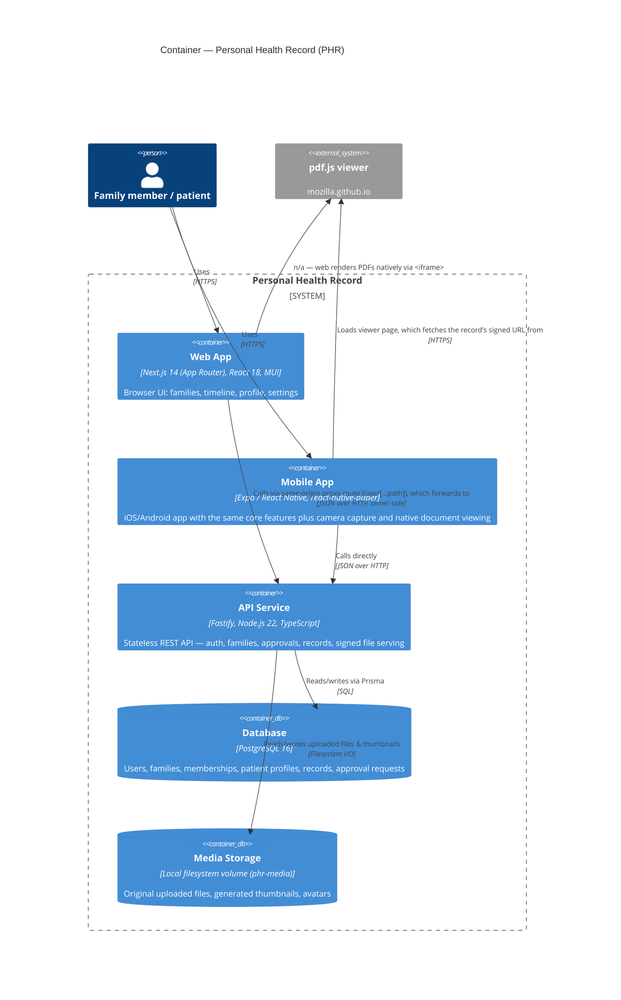

# C2 — Container

Zooming into the PHR system box: the deployable/runnable pieces and how they
talk to each other.

## Containers

### Web App (`apps/web`)
Next.js 14 App Router, MUI for components, client-side session stored in
`localStorage` (`phr_token`/`phr_user`, see
[Web app guide](Web-App#session--auth)). Every API call goes through
`apps/web/app/api/[...path]/route.ts`, a Next.js route handler that proxies to
the API service server-side (`API_INTERNAL_URL`) — this keeps the browser
same-origin with the API for normal CRUD calls. **File downloads are the
exception**: `downloadUrl`/`thumbnailUrl` are absolute, pre-signed URLs pointing
directly at the API's public origin (`API_PUBLIC_URL`), fetched straight from
the browser, bypassing the proxy entirely (see
[C3](C3-Component#filesroutes) and [API reference → Files](API-Reference#files)).

### Mobile App (`apps/mobile`)
Expo-managed React Native app. Calls the API directly (no proxy layer — there's
nothing to proxy through on a mobile OS), using `EXPO_PUBLIC_API_URL` as the
base URL. Session persisted in `AsyncStorage`. See
[Mobile app guide](Mobile-App).

### API Service (`apps/api`)
Fastify, stateless (no server-side session — every protected route validates a
Bearer JWT per request via the `authenticate` plugin). One process handles
everything: routing, business rules, file storage, thumbnail generation, OCR.
See [C3 — Component](C3-Component) for its internals and
[Backend service guide](Backend-Service).

### Database
PostgreSQL 16, accessed exclusively through Prisma from the API service — no
other container talks to the database directly. Schema/migrations live in
`apps/api/prisma/`. See [Data model](Data-Model).

### Media Storage
A local filesystem directory (`MEDIA_ROOT`, mounted as a named Docker volume
`phr-media` in production — see [Deployment](Deployment)). Not a separate
network service; it's local disk the API container reads/writes directly. Files
are served back out through the API's own `/files/*` route rather than through
a static file server or CDN, gated by a signed URL rather than by
authentication (see [C3 — filesRoutes](C3-Component#filesroutes)).

## Why the web app has a proxy and the mobile app doesn't

The web app's `/api/[...path]` proxy exists so the browser only ever talks to
its own origin for JSON calls — simpler CORS story, and it's the natural place
to keep `API_INTERNAL_URL` (a Docker-network-internal hostname like
`http://api:4000`) out of the browser entirely. Mobile has no "origin" concept
in the same sense — it's a native app, not a browser tab — so it just points
directly at whatever `EXPO_PUBLIC_API_URL` is configured (typically the host
machine's LAN IP in dev). This is also why the API's CORS policy
(`apps/api/src/app.ts`) only needs to allow the web app's origin, not the mobile
app's — mobile HTTP requests aren't subject to browser CORS enforcement at all.
