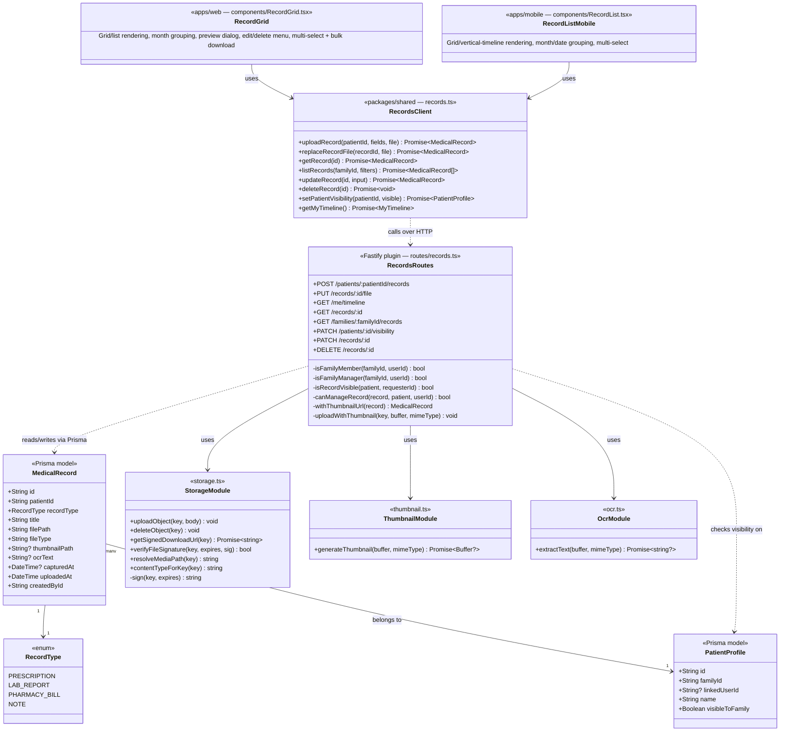

# C4 — Code

The most granular C4 level. Rather than an exhaustive (and quickly stale) class
diagram of the entire codebase, this documents the **Records domain** — the
part of the system with the most moving pieces (upload, thumbnails, OCR,
visibility rules, timeline queries) and the one most illustrative of how the
rest of the codebase is shaped. Every other domain (auth, families, approvals)
follows the same pattern: a Prisma model, a shared-package client/types module,
and a Fastify route file with a couple of local authorization helper functions.

## Reading this diagram

- **`RecordsRoutes`** is the only place authorization for records lives — see
  its four private helper methods. There's no separate "authorization service";
  these are plain TypeScript functions colocated with the routes that use them.
- **`RecordsClient`** (in `@phr/shared`) is the single typed contract both
  `RecordGrid` (web) and `RecordListMobile` (mobile) build their UI against —
  neither app hand-rolls `fetch()` calls for records. This is the pattern to
  follow for any new domain: add types + a client factory to `packages/shared`
  first, then consume it from both UIs.
- **Thumbnails are synchronous, OCR is not** — reflected here by
  `uploadWithThumbnail` being a private method on the route class (runs inline,
  blocks the response) while `OcrModule.extractText` is called but not awaited
  before responding (see [C3](C3-Component#thumbnail-generation-is-synchronous-ocr-is-not)).
- This same shape — Prisma model + shared-package client + Fastify route file
  with local auth helpers + a web component + a mobile component — repeats for
  **Family** (`family.ts` client, `FamilyGroupsSection`/`Sidebar` on web,
  `FamilyDetailScreen`/`DrawerContent` on mobile) and **User** (`auth.ts`
  client, `ProfilePage`/`AppearanceSection` on web, `ProfileScreen` on mobile).
  Records was chosen for this page because it's the domain where that shape is
  most stress-tested (file handling, background jobs, multi-view rendering).
