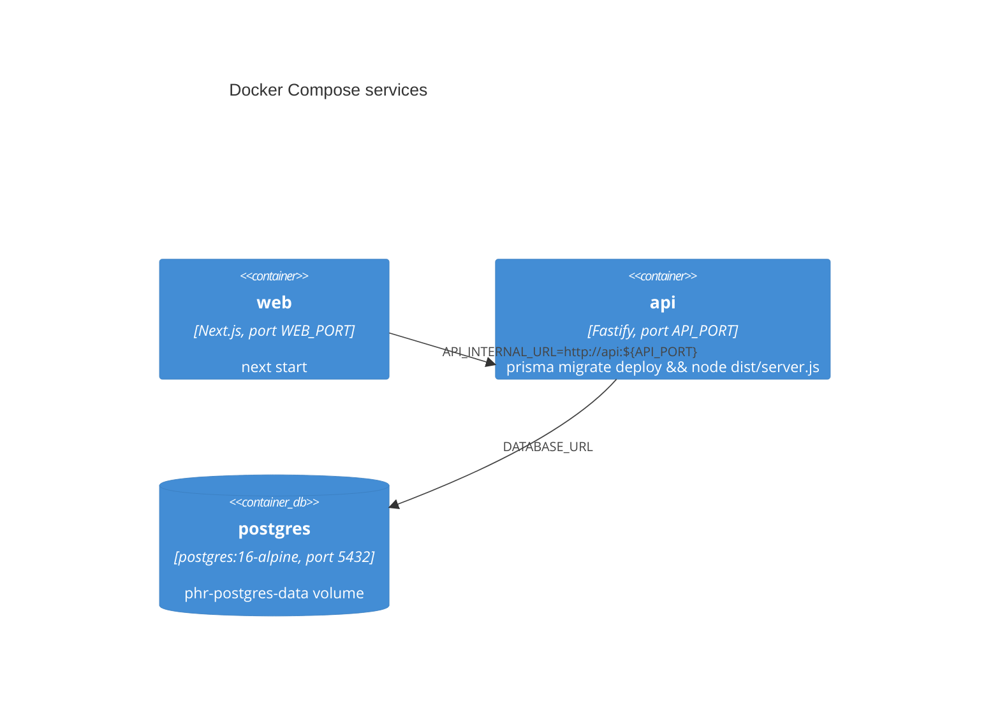

# Deployment

Docker Compose, three services + one volume for uploaded media. No
orchestration platform (Kubernetes, ECS, etc.) — this is sized for a single
host.

## `docker-compose.yml`



`api` depends on `postgres`'s healthcheck (`pg_isready`); `web` depends on
`api` (start-order only, not a health-based wait). The API container runs
`npx prisma migrate deploy` as the **first thing in its `CMD`**, every time it
starts — migrations apply automatically on deploy, no separate migration step
needed in CI/CD.

`phr-media` is a named volume mounted at `/app/media` inside the `api`
container (`MEDIA_ROOT`). Swap it for a host bind mount
(`./data/media:/app/media`) if you want uploaded files directly visible on the
host filesystem.

## Environment variables

Set via a `.env` file at the repo root (see `.env.example`) — `docker-compose.yml`
interpolates `${VAR}` from it.

| Variable | Consumed by | Notes |
|---|---|---|
| `JWT_SECRET` | api | **Set a real value in production** — the code fallback is `"dev-only-change-me"` |
| `API_PORT` | api, web | Port the API listens on / that web's proxy targets |
| `API_PUBLIC_URL` | api | Must be the URL **clients** (browsers, phones) can actually reach — not `http://api:4000` (that's Docker-internal only). Gets baked into every signed file URL. |
| `WEB_ORIGIN` | api | CORS allow-list entry for the web app's public origin |
| `ADMIN_EMAIL` / `ADMIN_PASSWORD` | api | Bootstrapped as an `isAdmin` account on every startup (idempotent). Unset skips bootstrap with a warning — no one can reach the admin panel until it's set. See [Backend Service → Admin](Backend-Service#admin-pluginsrequireadmints) |
| `WEB_PORT` | web | Port `next start` binds to |
| `NEXT_PUBLIC_API_URL` | web (build-time) | Only needed if you're *not* using the same-origin `/api` proxy — see [Web app guide](Web-App#the-apipath-proxy) |
| `EXPO_PUBLIC_API_URL` | mobile (dev only, not part of the Docker stack) | Must be reachable from the *device*, e.g. the host machine's LAN IP, not `localhost` |

See [Backend service → Environment variables](Backend-Service#environment-variables)
for `DATABASE_URL`, `FILE_SIGNING_SECRET`, and `MEDIA_ROOT`.

## Rebuilding after code changes

```bash
docker compose build api web
docker compose up -d api web
```
`docker compose build` doesn't restart running containers by itself —
`up -d` is a separate, required step. It's easy to change code, rebuild the
image, and then wonder why the browser still shows old behavior because the
*running container* is still the previous image. Check with:
```bash
docker compose ps                                  # CREATED time per container
docker images | grep personal-health-record         # image build time
```

## Known Dockerfile gotchas (and why they're handled the way they are)

Both `apps/api/Dockerfile` and `apps/web/Dockerfile` build in two stages
(`builder` → `runtime`), copying only the specific `node_modules` subdirectory
each app needs into the final image. These issues have come up in practice —
worth knowing about before "simplifying" either Dockerfile:

### npm workspace hoisting is not stable across installs
Whether a given package ends up hoisted to the **root** `node_modules` or
nested under a specific app's `apps/<app>/node_modules` depends on the current
shape of the whole dependency graph (see
[Dependency hoisting across two major React versions](#dependency-hoisting-across-two-major-react-versions)
below) — it can change between one `npm install` and the next, even without
you touching that app's own `package.json`. Both Dockerfiles therefore:
1. `RUN mkdir -p apps/<app>/node_modules` before copying it, so the `COPY`
   step never fails outright if that install happened to hoist everything to
   root and leave nothing nested there.
2. Actually `COPY` that directory into the runtime image — its **absence**
   from `apps/web/Dockerfile` once caused `next start` to silently fall back to
   `npx` fetching `next` from the npm registry at container *startup*, because
   the local binary genuinely wasn't in the image.

If a build ever fails with `"apps/<app>/node_modules": not found` or a
container logs `npm warn exec ... will be installed`, this is why — check
whether the relevant package actually landed under that app's nested
`node_modules` locally (`ls apps/web/node_modules/next`) and make sure both the
`mkdir -p` guard and the `COPY` line for it exist.

### Next's build-time lockfile-patch check
`apps/web/Dockerfile` sets `NEXT_IGNORE_INCORRECT_LOCKFILE=1` on the build
step. Next.js has a legacy check (originally for an npm 8.3–8.4 bug) that makes
a registry HTTP call at the very end of `next build` to "patch" the lockfile —
harmless to skip on any modern npm, but it crashes the whole build with
`Cannot read properties of undefined (reading 'os')` if that HTTP call can't
complete (e.g. restricted network egress in a sandboxed build environment).
The actual build output is already correct at that point; this just stops it
from being thrown away.

### Dependency hoisting across two major React versions
This repo has `apps/mobile` on React 19 (React Native's requirement) and
`apps/web` on React 18 (MUI/Next 14's expectation) in the same npm workspace —
and it's caused two distinct real incidents:

1. **Mobile crashing at runtime** (`TurboModule` / Fabric errors) because
   `react-native` (hoisted to root) resolved a hoisted-root copy of `react`
   that didn't match the version `apps/mobile` itself depended on.
2. **Web's SSR build crashing** (`Cannot read properties of null (reading
   'useContext')`, inside `styled-jsx`) after fixing (1) — forcing React 19 to
   the root shifted `styled-jsx` (a `next` dependency with a loose
   `>=16.8` React peer range, hoisted to root because nothing else constrains
   it) onto the wrong React copy relative to web's own nested React 18 +
   `react-dom`.

Both were fixed the same way — a scoped entry in root `package.json`'s
`overrides`, forcing a specific package's resolution of `react` without
touching the default for everything else:
```json
"overrides": {
  "react-native": { "react": "19.1.0" },
  "styled-jsx": { "react": "18.2.0" }
}
```
**If you hit a React-version-shaped crash that makes no sense given the code
you changed** (hooks returning `null`, dispatcher errors, `useContext` on
`null`), suspect this before anything else. Diagnose by finding every copy of
`react` in the tree and checking which package resolves which:
```bash
find . -path '*/node_modules/react/package.json' \
  -not -path '*/node_modules/*/node_modules/*/node_modules/*' \
  -exec sh -c 'echo {}; grep -m1 version {}' \;
```
A blanket top-level `"react": "X"` override will **not** work here — it forces
every workspace's own direct dependency to that version too, including
`apps/mobile`'s, which then conflicts irreconcilably with `react-native`'s peer
requirement (npm's `ERESOLVE`, not a runtime bug — at least that one fails
loud). Scope the override to the specific *dependent package* that's actually
resolving the wrong copy, the way both fixes above do.
